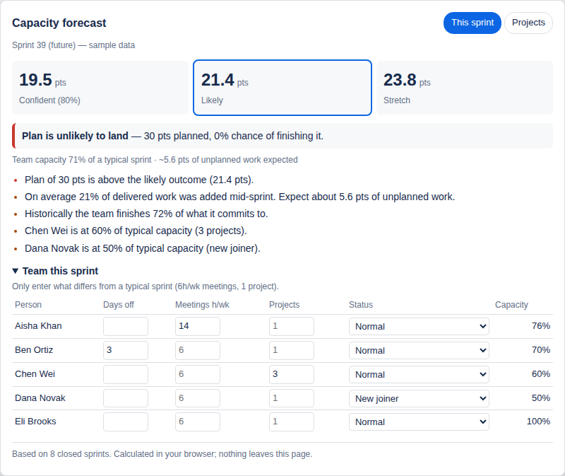
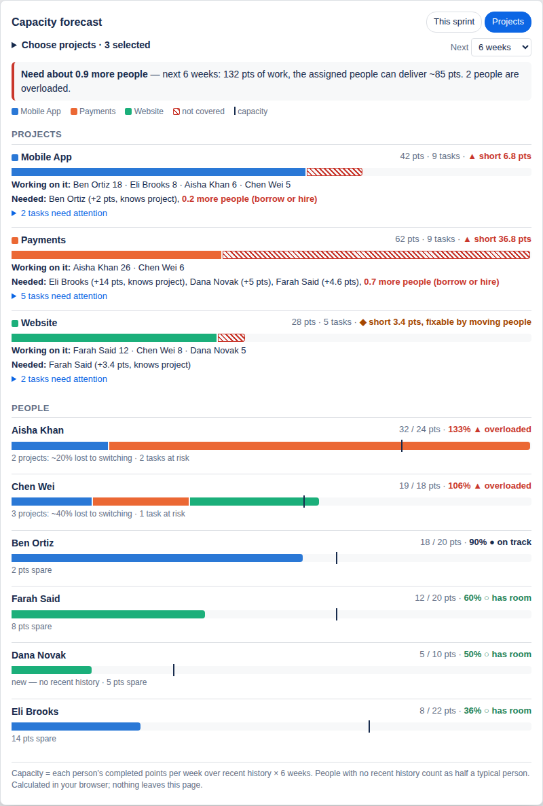

# Behavioural Capacity Forecasting

A browser extension for Jira that answers the question project managers spend hours on:

> **What can this team *really* deliver next sprint?**

Velocity averages and "hours × allocation %" assume every sprint is typical. This extension
adjusts the forecast for how people actually work: meeting load, leave, being split across
projects, new joiners, and the unplanned work that lands mid-sprint.



## What it shows

On any Jira board or backlog, click **Capacity forecast** (bottom-right). The panel has two tabs.

### This sprint

- **Confident / Likely / Stretch** points for the planned sprint (80th / 50th / 20th percentile of a Monte Carlo simulation over your own sprint history)
- **Chance your current plan lands**, with a plain-language verdict
- **Risks**: over-commitment, unplanned-work tax, historical plan reliability, and people with reduced capacity
- **Team this sprint**: enter only what differs from a typical sprint (days off, meeting hours, number of projects, new joiner / back from leave) and the forecast updates instantly

### Projects

Compare up to 8 projects over the next 2–12 weeks:

- **Projects**: work coming up vs what the assigned people can deliver. A hatched bar means work nobody can cover. Expand a project to see who works on it and which tasks are unassigned or at risk.
- **People**: one bar per person, split by project, with a marker at their capacity. Shows who is overloaded, who has room, and who loses time switching between projects.
- **Who will be needed**: for each short project, which people with spare capacity should help (people who already know the project come first), and how many extra people to borrow or hire if that isn't enough.



## How the forecast works

**This sprint tab**

| Signal | Source | Effect |
|---|---|---|
| Throughput | Last 8 closed sprints (Jira sprint reports) | Resampled 10,000 times |
| Unplanned-work share | Points completed that were added mid-sprint | Subtracted from capacity for planned work |
| Leave | Days off per person | Fewer working days |
| Meeting load | Meeting hours/week vs your team's typical | Less focus time |
| Context switching | Projects per person (Weinberg's yields: 2 → 80%, 3 → 60%, 4 → 45%) | Less productive time |
| Ramp-up | New joiner (50%), back from leave (80%) | Reduced output for that sprint |

**Projects tab**

- *Capacity* is each person's completed points per week over the last 12 weeks (configurable), multiplied by the horizon. People with no recent history count as half a typical person.
- *Upcoming work* is unfinished issues in the selected projects that are in a current or future sprint, already in progress, or due within the horizon. Sub-tasks are excluded so points aren't counted twice.
- Each person works through their tasks in due-date then rank order. Whatever doesn't fit in their capacity is *at risk*.
- A project's *shortfall* is its unassigned work plus at-risk work. It is filled first from spare capacity of people who know the project, then from anyone with room. The rest is converted into "extra people needed".
- If the projects have no estimates, everything is counted in tasks instead of points.

The engines live in [`src/engine/`](src/engine/): plain JavaScript, no dependencies, fully unit tested.

## Privacy

- Runs entirely in your browser. There is no server, no analytics, and no data leaves the page.
- Reads Jira using your existing login (same-origin requests), so no API token is needed.
- Team adjustments are stored locally (`chrome.storage.local`), per sprint.
- It doesn't monitor individuals. People's inputs are things they would say in sprint planning anyway.

## Install

**From a release (recommended)**

1. Download `extension.zip` from the [latest release](../../releases/latest) and unzip it.
2. Open `chrome://extensions` (or `edge://extensions`, `brave://extensions`).
3. Turn on **Developer mode**, click **Load unpacked**, and select the unzipped folder.
4. Open a Jira Cloud board or backlog and click **Capacity forecast**.

**From source**: clone this repo and choose the repo folder in step 3.

Click the extension icon and choose **Try the demo** to see it with a sample team, no Jira needed.

### Settings

Open the extension's **Settings** to describe a typical sprint: working days, hours per day,
typical meeting hours, typical projects per person, and how many sprints of history to use.

## Requirements and limits

- Jira **Cloud** (`*.atlassian.net`) Scrum boards with story-point (or other numeric) estimates.
- At least 3 closed sprints. 6 or more gives steadier ranges.
- Sprint history comes from the same endpoint Jira's own Sprint Report uses (`/rest/greenhopper/1.0/rapid/charts/sprintreport`). It is widely used but not officially documented.
- Team capacity on the Sprint tab assumes people contribute equally. Per-person weighting is on the roadmap.
- The Projects tab only sees the selected projects. Someone busy on an unselected project will look like they have spare capacity, so include every project your people share.
- "Future sprints" can include sprints beyond the horizon, so far-off planned sprints are counted as upcoming work.

## Development

```bash
npm test              # unit tests (Node 18+, no install needed)
npm run package       # builds dist/extension.zip
python3 -m http.server  # then open http://localhost:8000/demo/demo.html
```

```
manifest.json          Chrome/Edge MV3 manifest
src/engine/            forecasting models: sprint (forecast.js), cross-project (portfolio.js)
src/jira/              Jira Cloud API client
src/ui/                panel, tabs and Projects view (shared by Jira and the demo)
src/content/           content script injected into Jira
pages/                 popup and settings pages
demo/                  standalone demo with sample data
tests/                 node:test unit tests
```

Releases: bump `version` in `manifest.json` and `package.json` and merge to `main`. GitHub Actions publishes a release for that version with `extension.zip` attached.

## Roadmap

- [ ] Google / Outlook calendar import for meeting load (opt-in, busy/free only)
- [ ] Per-person estimation-bias calibration (estimate vs actual by task type, visible only to that person)
- [ ] What-if planner: move a person, cancel a meeting series, defer an epic
- [ ] Release-level forecasts across multiple sprints
- [ ] Firefox support and Chrome Web Store listing

## License

[MIT](LICENSE)
